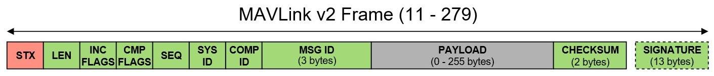

# MAVLink

MAVLink는 직렬 통신으로 무인이동장치와 GCS간의 데이터와 명령을 송수신하는데 사용되는 경량 메시지 프로토콜이다. 이 메시지는 XML파일로 정의되는데 특정 MAVLink 시스템이 지원하는 이런 XML 파일 메시지를 dialect라고도 한다.

개별 dialect를 사용하기 위해서 MAVLink 소스 파일을 다운로드하거나 생성할 수 있다. 만약 C/C++로 작업하고 표준 dialect를 사용할 경우에는 '빌드 전 MAVLink 소스 파일'을 다운로드하여 그대로 사용할 수 있다. 그러나 C/C++가 아닌 다른 언어로 작업하거나 MAVLink 메시지나 dialect를 추가/수정하고 싶은 경우 MAVLink 소스 파일을 생성해야 한다. 

MAVLink 소스 파일을 생성하려면 우선 MAVLink를 설치해야한다. MAVLink를 설치한다는 것은 'XML 메시지 정의'와 이를 사용해서 MAVLink 소스 파일을 생성하는 'GUI/명령 라인 툴'을 포함하는 MAVLink 툴체인을 설치한다는 의미이다.

## 1. Ubuntu에 MAVLink 설치하기

    % pip install future
    % sudo apt-get install python3-tk
    % git clone https://github.com/mavlink/mavlink.git --recursive  // mavlink 복제
    % vi ~/.bashrc      // bash shell로 진행
      export PYTHONPATH={mavlink 복제된 경로}
    % exit              // 터미널창 껏다 키기
    % echo $PYTHONPATH  // 경로 확인

## 2. MAVLink 라이브러리 생성하기 [ref](https://kwangpil.tistory.com/82)
MAVLink를 설치하였다면 MAVLink Generator를 사용해서 MAVLink 라이브러리를 생성할 수 있다. Generator를 사용하면 XML 파일인 dialect를 특정 프로그래밍 언어의 MAVLink 라이브러리로 변환할 수 있다. MAVLink 프로젝트에서는 GUI 형식인 mavgenerate와 CLI형식인 mavgen이라는 두 개의 코드 생성기를 제공한다. 

### 2-1. mavgenerate 사용하는 경우
    % python mavgenrate.py       // mavlink를 복제한 폴더에서 mavgerate.py 실행
    // XML 빈칸에는 MAVLink 라이브러리를 생성할 dialect를 입력 : /home/choiyungyu/mygit/mavlink/message_definitions/v1.0/ardupilotmega.xml
    // Out 빈칸에는 생성될 라이브러리를 저장할 폴더 지정 : /home/choiyungyu/mygit/pr.DroneGCS/kisa-gcs-service/MAVSDK 
    // Laguage는 CS를 선택하고 Protocol은 2.0 선택

    // Rider Solution창에서 project 우클릭 -> Manage NuGet Packages 클릭 -> 검색 창에서 MAVLink 검색 후 우클릭 +install... 클릭

### 2-2. mavgen 사용하는 경우

## 3.MAVLink Protocol

### 3-1. Frame 

[ref](https://kimdictor.kr/post/embedded/mavlink/)
- STX: 0xFD로 고정된 패킷 시작 마커
- LEN: "PAYLOAD" 부분의 기링
- INC FLAGS: MAVLINK 호환 플래그, 이해할 수 없는 플래그를 가진 패킷은 버려진다. 보통은 0x00 이다.
- CMP FLAGS: MAVLINK 비호환 플래그, 이해할 수 없는 플래그를 가진 패킷도 처리된다. 비표준 구현체등에 사용도리 수 있다. 보통 0x00이다.
- SEQ: 메세지의 시퀀스 번호
- SYS ID: 송신자의 시스템 ID, 용도나 구현체에 따라서 임의로 지정
- COMP ID: 송신자의 컴포넌트 ID, 용도나 구현체에 따라서 임의로 지정
- MSG ID: 3바이트로 구성된 메시지 ID, 메시지의 의미 나타냄
- PAYLOAD: 메세지의 실제 데이터 (최대 255 바이트)
- CHECKSUM: 메시지의 CRC 체크섬
- SIGNATURE: 메세지의 서명 (보통은 생략)
- (최소 패킷 길이는 페이로드 0바이트인 메시지로 11바이트 이다.)
- (최대 패킷 길이는 255바이트 페이로드인 서명된 메시지로 279바이트 이다.)

#### 드론 식별 
- 시스템 아이디: 드론 또는 GCS 를 고유하게 식별하는데 사용되는 숫자, 하나의 시스템이 여러 개의 컴포넌트를 가질 수 있으며, 시스템 아이디는 이들을 구별 한다.
- 컴포넌트 아이디: 하나의 시스템 내에서 여러 개의 컴포넌트가 존재할 수 있다. 예를 들어, 비행 컨트롤러, GPS 모듈, 카메라 등이 각각 다른 컴포넌트가 될 수 있다.
- 이러한 아이디 들을 사용하여 MAVLink 메시지를 통해 드론과 지상 제어 시스템 간의 특정 통신을 식별할 수 있다.  
  예를 들어, 특정 메시지가 어떤 드론의 비행 컨트롤러에서 왔는지 확인할 수 있다. 

### 3-2. MAVLink Parsing
1) MAVLink 라이브러리 설치
2) MAVLink 메세지 데이터 수신
3) MAVLink 메세지 데이터 파싱

         0001. 1. 1. 오전 12:00:00,True,1,1,30,ATTITUDE
         - DateTime: 0001. 1. 1. 오전 12:00:00 
         - True/False: 해당 메시지 활성화 여부
         - Numbers:  
         - Message Name: MAVLink 메시지 식별자

4) MAVLink 메세지 데이터 객체화: 메세지에 대한 C# 클래스나 구조체가 필요, MAVLink는 XML 정의 파일을 통해 메시지에 대한 정보를 제공하므로, 
MAVLink의 XML 정의를 사용하여 C# 클래스를 생성할 수 있음

        MAVLink.MAVLinkMessage mavlinkMessage = // 디코딩한 MAVLink 메시지가 들어 있는 변수
    
        // 메시지의 ID를 기반으로 적절한 MAVLink 메시지 클래스 생성
        switch ((MAVLink.MAVLINK_MSG_ID)mavlinkMessage.msgid)
        {
            case MAVLink.MAVLINK_MSG_ID.HEARTBEAT:
                MAVLink.heartbeat_t heartbeat = MAVLink.MAVLinkMessageExtensions.Deserialize<MAVLink.heartbeat_t>(mavlinkMessage);
                // heartbeat 객체를 사용하여 무언가를 수행
                 break;
            case MAVLink.MAVLINK_MSG_ID.OTHER_MESSAGE_ID:
                // 다른 MAVLink 메시지에 대한 처리
                break;
            // 다른 메시지 ID에 대한 처리 추가
        }
        
        // Deserialize 메소드를 사용하여 메시지를 C# 객체로 변환할 수 있습니다.

## 4. MAVLink 발신 (Server to Drone)
        public async Task SendCommandAsync(IChannelHandlerContext ctx, IPEndPoint addr, MAVLink.MAVLinkMessage msg)
        {
            _context = ctx;
            _droneAddress = addr;
            
            // _context가 null 이거나 Channel이 활성화되지 않았을 경우 드론 통신을 위한 적절한 환경이 설정되어 있지 않다고 판단하고 메소드 중단
            if (_context is null || !_context.Channel.Active) return;
         
            try 
            {
                // WriteAndFlushAsync 메서드는 비동기적으로 작동하며, 메시지를 채널에 기록하고 즉시 채널을 플러시하여 즉시 전송한다.
                await _context.Channel.WriteAndFlushAsync(EncodeUdpDroneMessage(msg));
            } catch (Exception e) {
                Console.WriteLine(e.Message);
            }
        }
        
        private DatagramPacket EncodeUdpDroneMessage(MAVLink.MAVLinkMessage msg)
        {
            if (_droneAddress != null)
            {
                // MAVLink 메시지를 MAVLink 2.0 패킷으로 인코딩하여 바이트 배열로 만듬 (Netty 라이브러리의 Unpooled.WrappedBuffer를 사용하여 바이트 배열을 Netty의 버퍼로 래핑)
                var encodeMsg = Unpooled.WrappedBuffer(_parser.GenerateMAVLinkPacket20(
                    (MAVLink.MAVLINK_MSG_ID)
                    msg.msgid,
                    msg.data,
                    sign: false,
                    msg.sysid,
                    msg.compid,
                    msg.seq)
                );
    
                // 래핑된 버퍼와 드론 주소를 사용하여 새로운 DatagramPacket을 생성하고 반환, DatagramPacket은 네트워크 패킷을 나타내는 Netty 라이브러리의 클래스
                return new DatagramPacket(encodeMsg, _droneAddress);
            }
            throw new InvalidOperationException("_droneAddress is null.");
        }
    }

### 4-1. WrapperdBuffer 메서드
- Netty 라이브러리의 Unpooled.WrappedBuffer 를 사용하여 바이트 배열을 Netty 버퍼로 랩핑한다.

### 4-2. GenerateMAVLinkPacket20 메서드
- 이 메서드는 전송할 메시지지를 MAVLink2.0 프로토콜에 맞는 패킷으로 전환한다.

### 4-3. DatagramPacket 생성자
- DatagramPacket 은 네트워크 패킷을 나타내는 Netty 라이브러리의 클래스중 하나이다.
- 래핑된 버퍼와 드론 주소를 사용하여 새로운 DatagramPacket 을 생성하고 반환한다.

### 4-1. WriteAndFlushAsync 메서드
- 이 메서드는 비동기적으로 작동하며, 위에서 반환된 패킷을 채널에 기록하고 채널을 플러시하여 즉시 전송한다.

