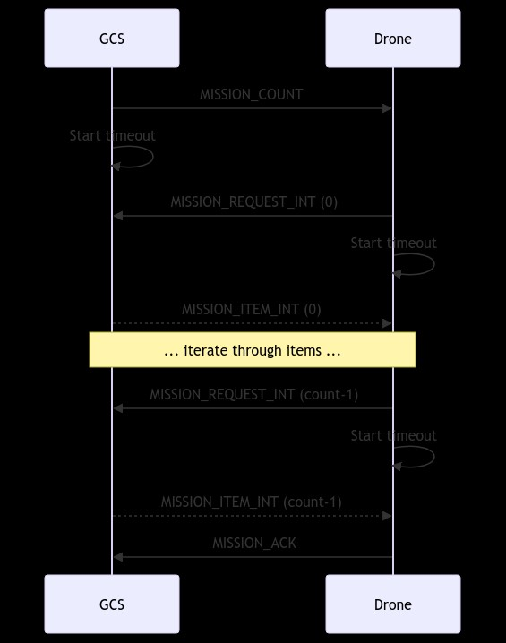
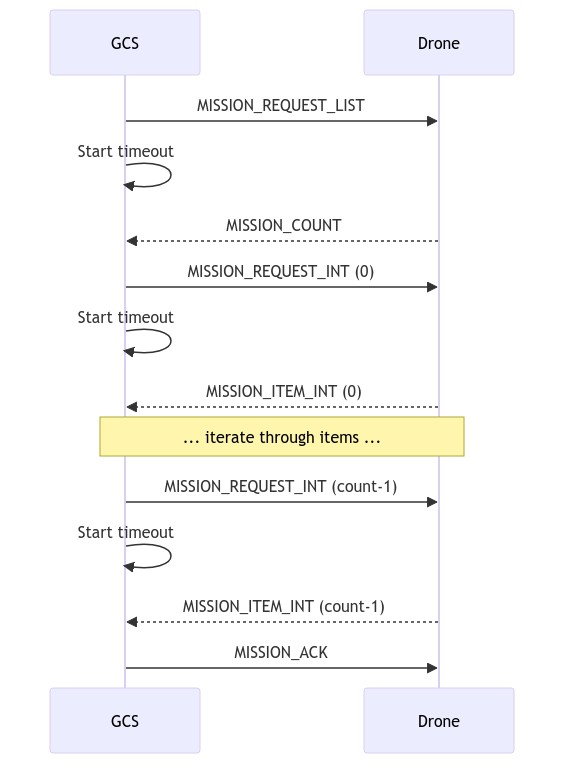
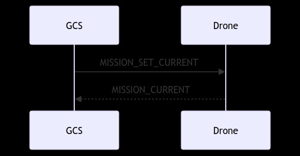

# Mission API

## 1. Mission API
- Ardupilot 에서는 "MISSION API"라고 불리는 여러 가지 기능이 제공된다.
- 이 API 는 미션 관련 작업을 수행하도록 설계되었다. 
- 자동 비행 경로를 작성하고 관리하며, 미션을 실행하고 모니터링하는 기능이 포함된다. 
- Mission API 를 사용하면 드론의 자동 비행 및 임무 수행을 프로그래밍적으로 제어할 수 있으며,   
  이를 통해 다양한 응용 프로그램을 개발할 수 있다.

### 1-1. 주요 기능 
#### 미션 작성 및 수정 
- 미션을 생성하고 수정하는 기능을 제공한다. 이를 통해 사용자는 드론이 따를 경로를 지정할 수 있다. 
- 미션은 일련의 waypoints 로 구성되며, 각 waypoints 는 위치, 고도, 동작 등을 지정할 수 있다.

#### 미션 업로드
- 작성한 미션을 드론에 업로드하여 실행할 수 있다.
- 이를 통해 드론에게 자동으로 비행 경로를 따르도록 할 수 있다.

#### 미션 실행 및 모니터링
- 업로드한 미션을 실행하고, 실행 중인 미션을 모니터링할 수 있다.
- 드론은 미션을 수행하면서 현재 진행 상황을 실시간으로 보고한다.

#### 미션 완료 및 결과 분석 
- 미션 실행이 완료되면 실행 결과를 받아올 수 있다. 
- 이를 통해 미션의 성공 여부를 확인하고 결과를 분석할 수 있다.

 

## 2. 미션 프로토콜 
[Mission Protocol](https://mavlink.io/en/services/mission.html)
- 미션 프로토콜이 다루는 작업 
  - 미션 업로드, 다운로드 및 삭제, 현재 미션 항목 번호 설정 또는 가져오기, 현재 미션 항목이 변경되면 알림 받는 작업
  - 미션 아이템 교환을 위한 메시지 유형 및 열거
  
### 2-1. 미션 유형 
- 비행 계획 (MAV_MISSION_TYPE_MISSION)
- 지오펜스 (MAV_MISSION_TYPE_FENCE)
- 집결/안전 지점 (MAV_MISSION_TYPE_RALLY)

### 2-2. 미션 아이템 
-  비행 계획
  - 탐색/이동을 위한 NAV 명령 (MAV_CMD_NAV_*, MAV_CMD_NAV_WAYPOINT, MAV_CMD_NAV_LAND)
  - 속도 변경이나 서보 활성화 같은 즉각 조치를 위한 DO 명령 (MAV_CMD_DO_*, MAV_CMD_DO_CHANGE_SPEED)
  - 조건에 따라 미션 실행을 변경하기 위한 CONDITION 명령 (MAV_CMD_CONDITION_DELAY: 다음 미션을 실행하기 전에 잠시 미션을 일시 중지)
- 지오펜스 미션 아이템 
  - MAV_CMD_NAV_FENCE_* (MAV_CMD_NAV_FENCE_RETRUN_POINT)
- 집결지 미션 아이템 
  - MAV_CMD_NAV_RALLY_POINT

#### 미션 아이템 매개 변수 
- 미션 아이템은 MISSION_ITME_INT MAV_CMD 메시지로 전송/인코딩 된다.
- 이 메시지에는 특정 임무 항목(명령 ID)과 최대 7개의 명령별 선택적 매개변수를 식별하는 필드가 포함되어 있다.
  - command(MAV_CMD): MAV_CMD 에 정의된 명령 ID
  - x: 탐색 명령에 대한 위도(글로벌 프레임)
  - y: 탐색 명령에 대한 경도 (글로벌 프레임)
  - z: 고도(프레임에 따라 상대 또는 절대 좌표)
  - target_system: 시스템 ID
  - target_component: 컴포넌트 ID
  - seq: 미션 내 아이템의 일련 번호(0부터 색인화)
  - frame(MAV_FRAME): waypoints 좌표계 (ArduPilot 과 PX4 모두 전역 프레이만 지원)
  - mission_type(MAV_MISSION_TYPE): 미션 유형
  - current: 다운로드 시 해당 아이템이 현재 미션 아이템인지 여부 (false:0, true:1)
  - autocontinue: 명령이 완료되면 다음 웨이포인트로 자동으로 계속 하는지 여부 (false:0, true:1)

#### 메시지 / 명령 / 열거 
- Message
  - MISSION_REQUEST_LIST: 미션 아이템 목록을 요청하여 시스템에서 미션 다운로드를 시작한다.
  - MISSION_COUNT: 미션에 포함된 항목 수를 보낸다. 이는 미션 업로드를 시작하거나 미션을 다운로드할 때 MISSION_REQUEST_LIST 에 대한 응답으로 사용된다.
  - MISSION_REQUEST_INT: MISSION_ITEM_INT 메시지를 사용하여 수신자가 특정 시퀀스 번호에 대한 미션 항목 데이터를 보내도록 요청한다. 미션 업로드 및 다운로드에 사용된다.
  - MISSION_ITEM_INT: 미션 항목/명령을 인코딩하는 메시지, 미션 업로드 및 다운로드에 사용된다.
  - MISSION_ACK: 시스템이 미션 작업을 완료할 때 확인하는 메시지이다. 메시지에는 성공 또는 실패 유형을 나타내는 MAV_MISSION_RESULT 가 포함된다.  
    (예: 모든 임무 항목을 업로드한 후 자동 조종 장치에 의해 전송됨)
  - MISSION_CURRENT: 현재 미션 아이템 시퀀스 번호, 미션 상태, 현재 미션 ID 및 기타 정보가 포함된 메시지이다. 이는 현재 미션 항목이 설정/변경될 때 스트리밍되고 방출된다.
  - MISSION_SET_CURRENT: 현재 미션항목을 시퀀스 번호로 설정한다.(최단 경로에서 이 항목으로 계속?)
  - STATUSTEXT: 현재 미션 항목 설정 요청이 실패하면 시스템에 알리기 위해 전송된다. 
  - MISSION_CLEAR_ALL: 시스템에 저장된 모든 미션 아이템을 삭제하기 위해 보내는 메시지이다.
  - MISSION_ITEM_REACHED: 새로운 경유지에 도달할 때마다 시스템에서 내보내는 메시지이다. 진행 상황을 모니터링하는 데 사용된다.
- Command
  - MAV_CMD_DO_SET_MISSION_CURRENT: 현재 미션 항목을 설정하고 선택적으로 미션 카운터를 재설정한다. MISSION_SET_CURRENT를 대체한다.
- Enum 
  - MAV_MISSION_TYPE
    - 0(MAV_MISSION_TYPE_MISSION): 아이템은 메인 미션의 미션 명령이다.
    - 1(MAV_MISSION_TYPE_FENCE): GeoFence 영역을 지정한다. 항목은 MAV_CMD_NAV_FENCE_GeoFence 항목이다.
    - 2(MAV_MISSION_TYPE_RALLY): 차량의 집결 지점을 지정한다. 랠리 포인트는 대체 RTL 포인트이다. 
    - 255(MAV_MISSION_TYPE_ALL): 모든 임무 유형을 지우기 위해 MISSION_CLEAR_ALL 에서만 사용된다. 
  - MAV_MISSION_RESULT: MISSION_ACK 메시지 안에 있는 미션 조작 결과이다.
    - 0(MAV_MISSION_ACCEPTED): 미션 수락 OK
    - 1(MAV_MISSION_ERROR): 일반 오류/현재 임무 명령을 전혀 수락하지 않음
    - 2(MAV_MISSION_UNSUPPORTED_FRAME): 좌표계 미지원 
    - 3(MAV_MISSION_UNSUPPORTED): 명령 미지원 
    - 4(MAV_MISSION_NO_SPACE): 미션 아이템이 저장 공간 초과
    - 5(MAV_MISSION_INVALID): 매개변수 중 하나에 잘못된 값 존재
    - 6(MAV_MISSION_INVALID_PARAM1~4): param1~4 에 잘못된 값 존재 
    - 10(MAV_MISSION_INVALID_PARAM5_X): x 에 잘못된 값 존재 
    - 11(MAV_MISSION_INVALID_PARAM6_Y): y 에 잘못된 값 존재 
    - 12(MAV_MISSION_INVALID_PARAM7): z 에 잘못된 값 존재 
    - 13(MAV_MISSION_INVALID_SEQUENCE): 순서가 틀린 미션 항목 수신
    - 14(MAV_MISSION_DENIED): 이 통신 파트너로부터 어떤 미션 명령도 수락하지 않음
    - 15(MAV_MISSION_OPERATION_CANCELLED): 현재 미션 작업 취소됨
  - MAV_FRAME
  - MAV_CMD

### 2-3. 프레임 및 위치 정보 

### 2-4. 미션/계획 변경 감지 
- GCS 는 먼저 처량의 해당 계획과 일치하는 ID 가 있는지 확인하여 불필요한 업로드 및 다운로드를 피할 수 있다.
- GCS 는 계획의 업로드/다운로드된 부분에 대해 플라이트 스택의 ID 값을 현재 ID로 저장해야 한다.  
  그런 다음 MISSION_CURRENT 현재 계획 ID와 비교하여 캐시된 값을 모니터링하고 확인하여 일치하는 미션이 있는지 또는 차량에서 미션을 다운로드 해야 하는지 결정할 수 있다.

### 2-5. 차량에 미션 업로드 
- 미션 업로드는 드론에게 임무를 전송하는 프로세스이다.  
  사용자는 드론에게 비행 경로, 임무 지점, 작업 명령 등을 제공할 수 있다.
- 아래 다이어그램은 드론에 임무를 업로드하기 위한 통신 순서를 보여준다. (모든 작업이 성공한다고 가정)
  
- GCS는 MISSION_COUNT 를 Drone으로 보낸다. MISSION_COUNT 는 업로드될 미션 아이템 수(count)를 포함하고 있다. 
  - GCS 가 드론의 응답(MISSION_REQUEST_INT)을 기다리려면 timeout 이 시작되어야 한다.
  - **timeout**: 응답이 필요한 모든 메시지에 대해 시간 제한을 설정해야 한다.   
    시간 초과 이전에 예상된 응답을 받지 못한 경우 메시지를 다시 보내야 한다.  
    여러 번 재시도한 후에도 응답이 수신되지 않으면 클라이언트는 작업을 취소하고 유휴 상태로 돌아가야 한다.    
- Drone 은 메시지를 수신하고 첫 번째 미션 아이템을 요청하는 MISSION_REQUEST_INT(seq==0) 로 응답한다. 
  - Drone 이 GCS의 응답을 기다리려면 시간 초과가 시작되어야 한다.
- GCS 는 MISSION_REQUEST_INT 메시지를 받고 MISSION_ITEM_INT 메시지를 응답한다.
- Drone 과 GCS 는 MISSION_REQUEST_INT / MISSION_ITEM_INT cycle 모든 항목이 업로드될 때까지 반복한다.
- Drone 은 마지막 미션 항목을 받은 후 미션 업로드 완료/성공을 나타내는 MAV_MISSION_ACCEPTED 를 MISSION_ACK 에 담아 반환한다.
- GCS 는 Drone 이 반환한 미션 업로드 완료/성공을 나타내는 MAV_MISSION_ACCEPTED 가 담긴 MISSION_ACK 를 수신한다.

#### note
- 응답이 필요한 모든 메시지에 대해 시간 초과가 설정된다. 응답이 수신되지 않고 제한 시간이 만료되면 요청을 다시 보내야 한다.
- 미션 아이템은 순서대로 받아야 한다. 순서가 잘못된 항목을 받은 경우 예상 항목을 차량에서 다시 요청해야 한다(순서가 잘못된 항목은 삭제됨)
- 빈 미션(MISSION_COUNT 0)을 업로드하면 해당 미션을 클리어하는 것과 동일한 효과가 있다.

### 2-6. 차량에서 미션 다운로드 
- 미션 다운로드는 드론으로부터 저장된 임무 또는 비행 경로를 가져오는 프로세스 이다.  
  사용자는 드론에서 수행된 임무 및 비행 경로에 관한 정보를 가져올 수 있다.
- 아래 다이어그램은 드론에서 미션을 다운로드하기 위한 통신 순서를 보여준다. (모든 작업이 성공한다고 가정)
  
- 순서는 미션 업로드 순서와 유사하다. 
- 주요 차이점은 클라이언트(예: GCS)가 MISSION_REQUEST_LIST를 전송하며, 이는 autopilot 이 현재 항목 수(MISSION_COUNT)로 응답하도록 트리거 한다.
- 이는 GCS 가 임무 아이템을 요청하고 드론이 이를 공급하는 주기를 시작한다. 

#### note
- MISSION_COUNT.opaque_id 는 Drone 에서 업로드되는 계획 부분의 저장된 ID 이다. 
- opaque_id 는 나중에 Drone에 있는 것과 일치하는지 체크하기 위해서 GCS 에 저장되어야 한다. 

### 2-7. 현재 미션 아이템 설정 
- 아래 그림은 현재 미션 항목을 설정하기 위한 통신 순서를 보여준다.  
  
- GCS 는 새 시퀀스 번호를 지정하여 MAV_CMD_DO_SET_MISSION_CURRENT(또는 MISSION_SET_CURRENT seq)를 보낸다.
- Drone 은 메시지를 수신하고 현재 임ㅁ ㅜ시퀀스 번호를 업데이트하려고 시도한다. 

### 2-8. 임무 진행 상황 모니터링

### 2-9. 클리어 미션

### 2-10. 작업 취소

### 2-11. 작업 예외

#### 시간 초과 및 재시도

#### 오류/완료 