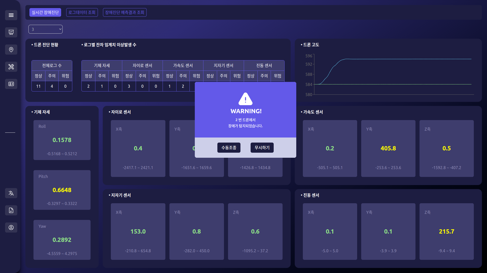

# Drone System

## Quick Start

    % cd /pr.DroneSytem
    % docker-compose up

## 1. Overview
With the advancement of drone technology today, there is a growing effort to utilize drones in various fields. However, due to the high level of difficulty in operating drones and safety concerns, they have not been adopted as quickly as demanded by the market. In response, a system has been developed to easily control multiple drones and detect anomalies using sensor data from the drones. 

## 2. Data Flow Chart

1. A drone sends MAVLink messages through a proxy server using TCP.
2. The MAV Proxy forwards MAVLink messages to the GCS using UDP.
3. The GCS sends telemetry sensor data to a Predict-server using gRPC.
4. The Predict-server performs anomaly detection and responds using gRPC.
5. And also the Predict-server stores sensor data, prediction results, and warning data in a database.
6. The GCS sends telemetry data, prediction results, and warning data from the drone to a React app using SignalR.
7. If the React app requests any information, the GCS serves the request accordingly.

## 3. Ground Control System
### [CSharp Source Code](./gcs-system)
TODO: GCS 에서 droneStateDict 전체를 React 로 내려주기

## 4. Predict System
### [Python Source Code](./predict-system)

## 5. Web APP
### [React Source Code](./web-app)

### 5-1. Dashboard

### 5-2. GCS

### 5-3. Real Time

### 5-4. Log Data

### 5-5. Predict Data

### 5-6. Warning Alarm Feature

