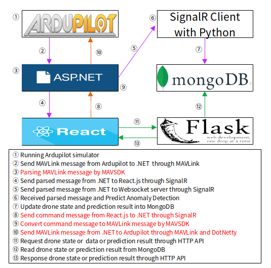

# GCS Service

## 1. Project Directory Structure

    kisa-gcs-service/
    ├── Controllers/
    ├── Hubs/                   
    │   ├── SignalRHub.cs
    ├── MAVSDK/                   
    │   ├── mavlink.cs
    │   ├── MavlinkCRC.cs
    │   ├── MAVLinkMessage.cs
    │   ├── MavlinkParse.cs
    │   ├── MavlinkUtil.cs
    ├── Models/                 
    │   ├── Drone.cs              
    ├── Services/               
    │   ├── DroneServiceMavlink.cs
    │   ├── DroneState.cs
    │   ├── MavLinkUdpMEssageDecoder.cs
    ├── Program.cs
    ├── Startup.cs
    ├── appsettings.json
    └── kisa-gcs-service.csproj

## 2. Project Data Flow Chart

## 3. Program.cs Procedure
1. Program.cs 에서 CreateHostBuilder 메소드를 사용해서 호스트 빌드
2. CreateHostBuilder는 Startup.cs를 참고해서 호스트 빌드
3. Startup.cs에서 애플리케이션 각종 설정
    - CORS 설정
    - EndPoint 설정
    - SignalR 설정
    - MavlinkNetty를 서비스 컨테이너에 등록 (UDP 통신할 때 사용하는 서비스)
      - 서비스 컨테이너에 등록되면서 MavlinkNetty의 생성자 동작
### 3-1. Parsing MavLink message by MAVSDK
      - 생성자에 의해 부트스트랩 생성 (부트스트랩은 데이터가 채널을 통과하는 동안 적용되는 처리단계인 파이프라인 정의)
      - 파이브라인에 의해 데이터가 들어오면 MavlinkDecoder가 생성됨
1. Program.cs 에서 MAVLinkReceiver 메소드를 사용해서 MavlinkNetty를 hubContext 주입해서 생성하고 StartAsync를 실행
2. StartAsync는 지정된 호스트 및 포트로 UDP 클라이언트를 시작하고 생성되어 있던 부트스트랩을 입력 받은 포트와 바인딩
3. 해당 포트를 통해 MavlinkMessage가 수신되고, 생성자에의해 정의된 파이프라인을 데이터가 거쳐가면서 MavlinkDecoder 실행
4. MavlinkDecoder는 
5. 