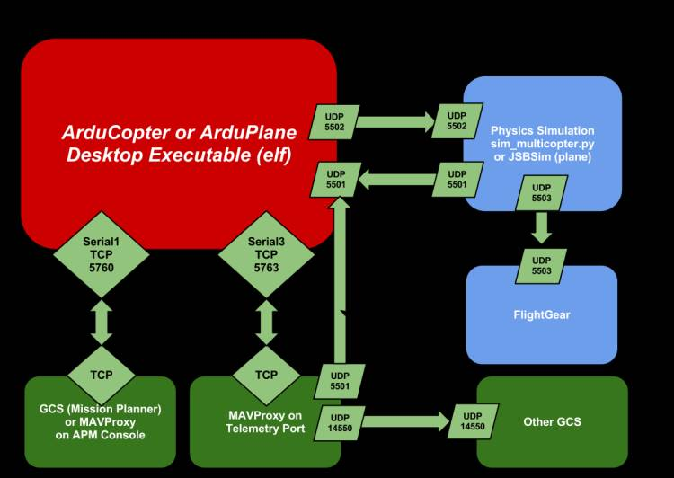

# Ardupilot
[Ardupilot SITL](https://ardupilot.org/dev/docs/sitl-simulator-software-in-the-loop.html)
- [Setting](https://ardupilot.org/dev/docs/building-setup-linux.html#building-setup-linux)
- [Running](https://ardupilot.org/dev/docs/sim-on-hardware.html)
- [Using](https://ardupilot.org/dev/docs/using-sitl-for-ardupilot-testing.html)

## 1. SITL 개요
SITL은 Software-In-The-Loop의 줄임말로써, Ardupilot 코드를 PC와 같은 Linux 머신 위에서 빌드 및 테스트 해볼수 있는 시뮬레이션 프로그램이다. SITL을 이용하면 Hardware에 종속되지 않고 Vehicle specific 코드를 테스트 할 수 있고, Physical 하지 않은 function들을 안전하게 테스트하고 디버깅할 수 있다. 즉, 실제 드론이 없어도 Ardupilot을 빌드하고 실행되는 모습을 볼 수 있으므로 편리하다. 

## 2. SITL 설치

    // install git
    % sudo apt-get update
    % sudo apt-get install git 
    % sudo apt-get install gitk git-gui

    // 필수 패키지 설치
    % sudo apt-get install python3-pip python3-dev python-matplotlib python3-opencv python3-pygame python-serial python3-wxgtk4.0 python-wxtools python-lxml
    % sudo apt-get install ccache gawk gcc-arm-none-eabi
    % sudo pip3 install MAVProxy pymavlink empy pexpect future PyYAML mavproxy --user

    % echo "export PATH=$PATH:$HOME/.local/bin" >> ~/.bashrc

    // 설치
    % (코드 fork) https://github.com/ArduPilot/ardupilot 
    % git clone --recurse-submodules https://github.com/choiyun9yu/ardupilot.git
      (intelliJ Run yarn install)
    % cd ardupilot
    % Tools/environment_install/install-prereqs-ubuntu.sh -y
    % . ~/.profile

    // 빌드 (Waf 라는 컴파일러 사용)
    % ./waf configure --board sitl
    % ./waf list
    % ./waf -j6

    // 실행
    % cd Tools/autotest
    % ./sim_vehicle.py --console --map -v ArduCopter

    // Sent simulation drone data to GCS server(Thang)
    python sim_vehicle.py -v ArduCopter -f hexa --out 127.0.0.1:14556

## 3. STL 사용

    % ./sim_vehicle.py {파라미터 입력}
| 옵션             | 설명                    | 예시                                                       |
|----------------|-----------------------|----------------------------------------------------------|
| --help         | 도움말 보기                | sim_vehicle.py --help                                    |
| -w             | 파라미터 초기화              | sim_vehicle.py -w                                        |
| --console      | 콘솔 창 보기               | sim_vehicle.py --console                                 |
| --map          | 지도 보기                 | sim_vehicle.py --map                                     |
| --list-vehicle | 기체 타입 보기              | sim_vehicle.py --list-vehicle                            |
| --list-frame   | 프레임 타입 보기             | sim_vehicle.py --list-frame                              |
| -v / -f        | 기체 / 프레임 타입 설정(기본 드론) | sim_vehicle.py -v ArduPlane -f quadplane --console --map |
| -L             | 지도 위치 변경              | sim_vehicle.py -L Seoul --console --map                  |
| --osd          | OSD 화면 보기             | sim_vehicle.py -v ArduPlane --console --map --osd        |

#### [드론 조작 명령어](https://ardupilot.org/dev/docs/copter-sitl-mavproxy-tutorial.html)
  
    # 시뮬레이터 실행시킨 터미널 창에 입력
    > mode auto     // 자동 모드
    > mode stabiliz // 스테빌라이즈 모드 (RC 조종기 입력에 직접적으로 응답하여 기체를 수평으로 유지)
    > mode guided   // 가이드 모드
    > mode land     // 착륙 모드
    > mode rtl      // 이륙 지점으로 돌아가기
    > mode poshold  // 포스홀드 모드 (기체가 현재 위치를 유지하면서 안정화)
    > mode Loiter   // 로이터 모드 (GPS 좌표를 정확하게 유지하면서 고도 및 방향도 유지)

    > arm throttle  // 시동 거는 명령
    > takeoff 40    // 고도 40
    > guided -35.3621741 149.16511256 40  // 위도 경도 고도 로 이동

    > param set RC1_MIN 1100
    > param set RC1_MAX 1900

 
 
 

### SheBang(#!)
#!는 주석이 아니라 하나의 기호이다. #!는 2Byte의 매직 넘버로 스크립트의 맨 앞에서 이 파일이 어떤 명령어 해석기의 명령어 집합인지를 시스템에 알려주는 역할을 한다.

#### [ERROR] /usr/bin/env: `python3\r': 그런 파일이나 디렉터리가 없습니다
두 운영체제의 줄바꿈이 달라서 발생하는 오류일 수 있다.  
- Windows/Dos 스타일 라인 줄 바꿈은 CR(\r)+LF(\n)
- Linux/MAC 스타일의 라인 줄바꿈은 LF(\n)

[해법1] doc2unix tool을 사용해서 윈도우/DOS 스타일의 줄 바꿈을 리눅스 스타일로 변환하여 저장

    % sudo apt inttall doc2unix
    % doc2unix fileName.py
    // 근데 이 방법은 모든 파일에 대해서 수동으로 적용해야하기 때문에 적합하지 않다.

[해법2] git 설정으로 원격 저장소에 파일을 올릴 때 CRLF와 LF 설정 바꾸기
- false: 개행문자를 CRLF 그대로 유지
- true: CRLF를 LF로 자동적으로 변환. 반대로 체크아웃 받을 때는 LF를 CRLF로 변환
- input: CRLF를 저장할때는 그대로 유지하고, 체크아웃할 때에만 줄 바꿈 문자를 LF로 변환

        % git config --global core.autocrlf true    // 윈도우인 경우
        % git config --global core.autocrlf input   // 리눅스인 경우

### Map이 출력되지 않는 경우
- 필수 라이브러리가 덜 설치되어 출력되지 않았던 것으로 추정