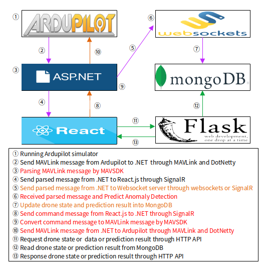

# GCS Service

## 1. Project Directory Structure

    kisa-gcs-service/
    ├── Controllers/
    ├── Hubs/                   
    │   ├── SignalRHub.cs
    ├── MAVSDK/                   
    │   ├── mavlink.cs
    │   ├── MavlinkCRC.cs
    │   ├── MAVLinkMessage.cs
    │   ├── MavlinkParse.cs
    │   ├── MavlinkUtil.cs
    ├── Models/                 
    │   ├── Drone.cs              
    ├── Services/               
    │   ├── DroneServiceMavlink.cs
    │   ├── DroneState.cs
    │   ├── MavLinkUdpMEssageDecoder.cs
    ├── Program.cs
    ├── Startup.cs
    ├── appsettings.json
    └── kisa-gcs-service.csproj

## 2. Project Architecture
